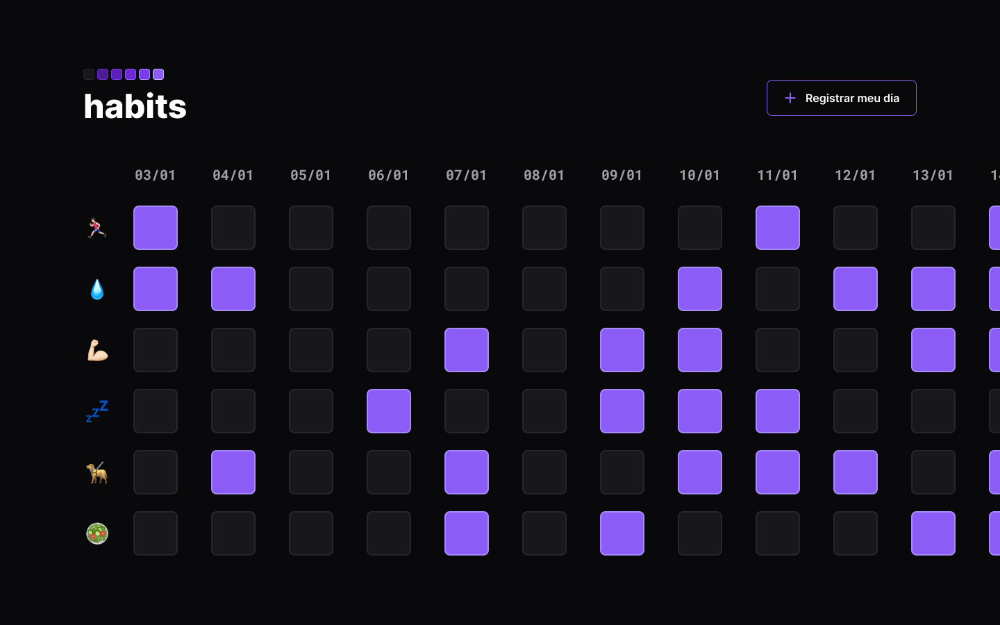

# <h1 align="center"> Projeto Habits 🚀  </h1>

[Acesse aqui 👈🏻](https://laynamoraes.github.io/nlw-setup/)
  

## 📜 Sobre

O projeto é página para controle e acompanhamento diário de hábitos.
  

## 🛠 Tecnologias utilizadas

- [HTML](https://developer.mozilla.org/pt-BR/docs/Web/HTML)
- [CSS](https://developer.mozilla.org/pt-BR/docs/Web/CSS)
- [JavaScript](https://developer.mozilla.org/pt-BR/docs/Web/JavaScript)
- [Git](https://git-scm.com/)
- [Figma](https://figma.com)
  

## ▶ Rodar o projeto

- Primeiro passo, clone o projeto em sua máquina
- Abra a pasta do projeto no terminal
- Instale as dependências com o comando `npm i` 
- Inicie o servidor com o comando `npm start` , uma nova aba irá se abrir no navegador, caso não ocorra
- Abre uma aba no navegar e navegue para localhost:3000
  
